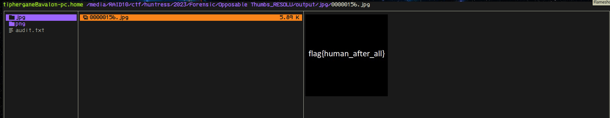

# Bad Memory

__author__: John Hammond

__synopsis__: We uncovered a database. Perhaps the flag is right between your fingertips!

NOTE: this flag does NOT follow the standard MD5 hash format, but does have the usual flag{} prefix and suffix. 

__Attachements__: thumbcache_256.db

---

Thumbcache est un fichier windows qui conserve les miniatures des images, nous allons donc creuser dedans pour voir ce que nous avons.

```bash
foremost thumbcache_256.db
```

Puis dans le répertoire output, nous trouvons le flag:



Le flag était :

flag{human_after_all}
