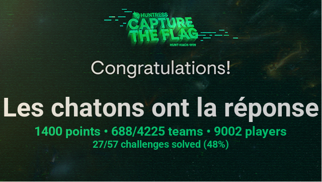

# Huntress_2023

CTF réalisé dans le cadre du cybermois par l'entreprise [huntress](https://www.huntress.com) (un lien avec [Huntress](https://dccomics.warnerbros.fr/articles/les-heros-dc/birds-of-prey-portrait-huntress) de bird of prey ? Qui sait, peut être que John Hammond me répondra s'il tombe sur mes writeups).

Qu'est-ce que le [cybermois ?](https://www.cybermalveillance.gouv.fr/tous-nos-contenus/actualites/cybermois-092023), c'est 30 jours où les entreprises de sécurité informatique comme [Onepoint](https://www.groupeonepoint.com) vont redoubler d'effort pour mettre en avant les bonnes pratiques en terme de sécurité informatique.

Cela ce passe par le biais de webinaires, compétitions, interventions dans les entreprises, publications d'articles, …

Ce CTF était par équipe, et c'est avec plaisir que j'y ai participé avec Sax

Pour le résultat final, il ne faut pas perdre de vue que nous avons réalisé ce score avec un temps actif __MAXIMUM__ de 3h par joueur.

Liste des Writeups:

__Forensic__

* [bad memory](./Forensic/Bad%20memory_RESOLU/readme.md)
* [Dumpster Fire](./Forensic/Dumpster%20Fire_RESOLU/readme.md)
* [Opposable Thumbs](./Forensic/Opposable%20Thumbs_RESOLU/readme.md)
* [Rogue Inbox](./Forensic/Rogue%20Inbox_RESOLU/readme.md)
* [Texas Chainsaw Massacre: Tokyo Drift](./Forensic/Texas%20Chainsaw%20Massacre:%20Tokyo%20Drift_RESOLU/readme.md) __résolu après le CTF__

__Miscellaneous__

* [MFAtigue](./Miscellaneous/MFAtigue_RESOLU/readme.md) __résolu après le CTF__

__Malware__

* [BlackCat](./Malware/BlackCat_RESOLU/) __résolu après le CTF__
